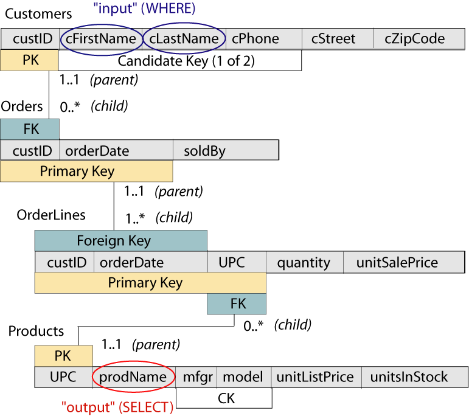
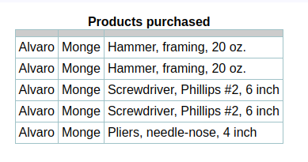
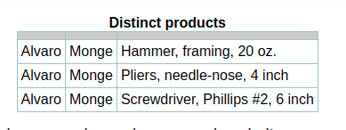

# 0x0E. SQL - More queries

&nbsp; <!-- blank line -->

## SQL technique: multiple joins and the distinct keyword

&nbsp;

It is important to realize that if you have a properly designed and linked database, you can retrieve information from as many tables as you want, specify retrieval conditions based on any data in the tables, and show the results in any order that you like.



The information that we need is found in the Products table. You could think of this as “output” from the query that will be part of the SELECT clause attribute list. The retrieval condition, or “input” to the query, is based on the Customers table—these attributes will be needed for the WHERE clause..

We can’t join Customers to Products, because they don’t have any common attributes. However, we can traverse a path using the relationships. From Customers, we can use the relation with Order to find orders placed. Next, use the relationship to OrderLines to find the details of the order. Finally, from OrderLines, we use the relationship to Products to get the information about the products included. Each time we follow a relationship, we will perform a join operation on the primary key and foreign key to link related rows together. This allows us to correctly associate the Customers data with the data about the Products the customers have placed

Look at the result set (all of the linked data). We won’t show the result here because of space limitations on the web page.

```sql
 SELECT *
        FROM customers
          NATURAL JOIN orders
          NATURAL JOIN orderlines
          NATURAL JOIN products;
```

As explained in another article, your database system might not support the `NATURAL JOIN` syntax that we show here. We’ll discuss this issue further when we look at join types. The multiple natural joins in our example work correctly because there are no non-pk/fk attributes in any of our tables that have the same name. In larger, more complicated databases, this might not be true and there would be serious unintended consequences in using a natural join!

Next, we need to restrict the rows in the result to only one customer.

```sql
 SELECT *
        FROM customers
          NATURAL JOIN orders
          NATURAL JOIN orderlines
          NATURAL JOIN products
        WHERE cFirstName = 'Alvaro' AND cLastName = 'Monge';
```

Finally, let's pick the columns we want. Notice that we are including the retrieval condition attributes in the SELECT clause, to be sure that this really is the right answer (there's no reason it wouldn't be, this is just for us).

```sql
SELECT cFirstName, cLastName, prodName
        FROM customers
          NATURAL JOIN orders
          NATURAL JOIN orderlines
          NATURAL JOIN products
        WHERE cFirstName = 'Alvaro' AND cLastName = 'Monge';
```



### The distinct keyword

Oops! We only wanted a list of the individual product names that this customer has purchased, but some of them are listed more than once. What went wrong?

If the RA version of our query could have actually been executed, each row of the result table above would be distinct—remember that a relation is a set of tuples, and sets can’t have duplicates—and there would of course be fewer rows than you see here.

SQL doesn’t work the same way. The reason for the duplicates is that the SELECT clause simply eliminated the unwanted columns from the result set; it left all of the rows that were picked by the WHERE clause.

The real problem in SQL is that the SELECT attribute list is not a super key for the result set. Look again very carefully at the relation scheme to understand why this is true. Any time that this happens, we can eliminate the duplicate rows by including the DISTINCT keyword in the SELECT clause. While making this revision, we’ll also list the product names in alphabetical order

```sql
        SELECT DISTINCT cFirstName, cLastName, prodName
        FROM customers
          NATURAL JOIN orders
          NATURAL JOIN orderlines
          NATURAL JOIN products
        WHERE cFirstName = 'Alvaro' AND cLastName = 'Monge'
        ORDER BY prodName;
```



#### closing

A sloppy way to be sure that you never have duplicate rows would be to always use the DISTINCT keyword. Please don’t do this—it just keeps you from understanding what is really going on in the query. If the SELECT attribute list does form a super key of the FROM clause (result set), the DISTINCT keyword is not needed, and should not be used. Also, requesting duplicates to be removed is a costly operation! How would you remove duplicates? The task is more difficult than you might imagine since there might be so much data that it cannot be stored in RAM and thus all resides on disk. How do you remove duplicates in that case?

<!-- markdownlint-disable-next-line -->
#### References

[SQL technique: multiple joins and the distinct keyword](https://web.csulb.edu/colleges/coe/cecs/dbdesign/dbdesign.php?page=sql/multijoin.php)

<!-- markdownlint-disable-next-line -->
#### Credits

Work is owned and maintained by [Michael C. Iyke](https://github.com/michaeliyke).

#### Acknowledgement

All work contained in this project was completed as part of the curriculum for Alx. ALX is a leading technology training provider, built to accelerate the careers of young Africans through the technology and professional skills that enable them to thrive in the digital economy. The program prepares students for careers in the tech industry using project-based peer learning. For more information, [visit](https://www.alxafrica.com/).
