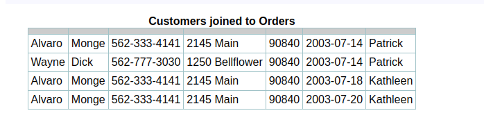
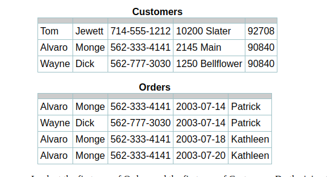
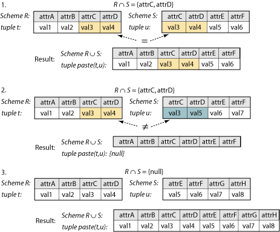

# 0x0E. SQL - More queries

&nbsp; <!-- blank line -->

## Basic query operation: the join

In most queries, we will want to see data from two or more tables. To do this, we need to `join` the tables in a way that matches up the right information from each one to the other—in our example, listing all of the customer data along with all of the order data for the orders that each customer has placed. In the latest SQL standard, the join is specified in the FROM clause:

```sql
   SELECT *
        FROM customers
          NATURAL JOIN orders;
```



- The NATURAL JOIN keyword specifies that the attributes whose values will be matched between the two tables are those with matching names; with very rare exceptions, these will be the pk/fk attributes, and they have to have matching data types (and domains) as well. The join attributes that are matched—here {cfirstname, clastname, cphone}—are shown only once in the result, along with all other attributes of both tables.

- Notice that all of the customer information is repeated for each order that the customer has placed; this is expected because of the one-to-many relationship between Customers and Orders. Notice also that any customer who has not placed an order is missing from the results; this is also expected because there is no fk in the Orders table to match that customer's pk in the Customer's table.

- The NATURAL JOIN shown here matches the RA join definition precisely. Unfortunately, not all database systems support the NATURAL JOIN keyword, so you may have to use a different syntax and may see slightly different results. We will discuss other join types in a later page.

### How it words

The easiest way to understand the join is to think of the database software looking one-by-one at each pair of rows from the two tables



- Look at the first row of Orders and the first row of Customers. Do the join attributes (pk/fk pair) match? No, so nothing happens; these rows are not part of the join results. Now look at the first row of Orders and the second row of Customers. Do the join attributes (pk/fk pair) match? Yes, they do. All of the attributes of each row are pasted together (with one copy of the matching pk/fk pair). You can see this in the first row of the SQL join example above. First row of Orders and third row of Customers? No match, so no resulting row.

- Next, look at the second row of Orders and the first row of Customers. No match, no resulting row. Same with second row of Orders to second row of Customers. Second row of Orders to third row of Customers? Yes; these are pasted together and included in the result.

- Repeat this for the third and fourth rows of Customers and all of the rows of Orders. Two matches are found, which results in two pasted rows in the result. Notice that none of the Orders rows have matched the first row of Customers.

- If you have taken even the most basic course in algorithms, you will realize that SQL doesn’t really implement the join in the way that we’ve just described it. However, this mental model will help you to follow the RA definition (below), with the inside workings of the database software left to a more advanced course or tutorial.

### RA syntax

The RA join of two relations, r over scheme R and s over scheme S, is written r ⋈ s, or in our example, customers ⋈ orders. The scheme of the result, exactly as you have seen in the SQL syntax, is the union of the two relation schemes, R∪S. The join attributes are found in the intersection of the two schemes, R∩S. Clearly, the intersection attributes must inherit the same assignment rule from R and S; this makes the two schemes compatible.

- The result of the RA join consists of the pairwise paste of all tuples from the two relations, written paste(t,u) for any tuple t from relation r over scheme R and u from relation s over scheme S. The result of the paste operation is exactly as explained in the preceeding section.

- In the very, very rare case where there is no intersection between schemes R and S (that is, R∩S = {null}), the schemes are still compatible and every tuple from relation r is pasted to every tuple from relation s, with all of the attributes from both schemes contained in the resulting tuples. In set theory, this is a Cartesian product of the two relations; in practice, it is almost always nonsense and not what you want. The Cartesian product can also be written in RA as r × s, or intentionally specified in SQL with the CROSS JOIN keyword.

- You might want to visualize the three possible results of the paste operation using the graphic representation of schemes and tuples that we presented in an earlier page.



<!-- markdownlint-disable-next-line -->
#### Credits

Work is owned and maintained by [Michael C. Iyke](https://github.com/michaeliyke).

#### Acknowledgement

All work contained in this project was completed as part of the curriculum for Alx. ALX is a leading technology training provider, built to accelerate the careers of young Africans through the technology and professional skills that enable them to thrive in the digital economy. The program prepares students for careers in the tech industry using project-based peer learning. For more information, [visit](https://www.alxafrica.com/).
